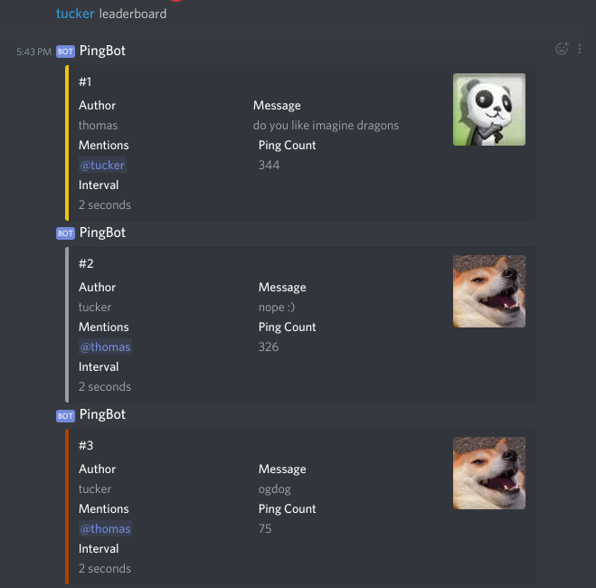

# PingBot
A simple Discord bot I made for fun to get familiar with [discord.py](https://github.com/Rapptz/discord.py). :)

### Hosting
*I wouldn't recommend using this bot in servers any larger than a few people. This bot is really annoying.*

You'll need Python 3.4.2+ to run this bot.

1. Install discord.py
```
python3 -m pip install -U discord.py
```

2. Clone the repo
```
git clone https://github.com/BigHeadGeorge/pingbot.git
```

3. [Create an application on Discord](https://discordapp.com/developers/applications/) and put your token in config.py.

4. Add the bot to your server.

5. Navigate to wherever you cloned the repo and run
```
python3 bot.py
```
and you're good to go! :)

### How to Use 
He has two commands. That's it.

- Annoy your friends with
```
tell @mention "message" every n seconds
```


	- The ping is stopped if the author sends `stop` or if the victim sends a message in that channel.


- Check the leaderboard to see who the most annoying person in the server is
```
leaderboard
```



	- The leaderboard shows the top 3 pings sent in a server.

Have fun, and don't send 1 second pings because that's how you get ratelimited. :)
